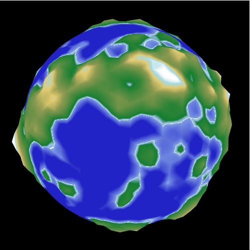

# Procedural planet generation

Little program which generate planets. A simple system of LOD (level of details) based on [this project](https://github.com/sp4cerat/Planet-LOD) has been used.

- WebGL
- HTML/CSS/JS/GLSL

## Result

